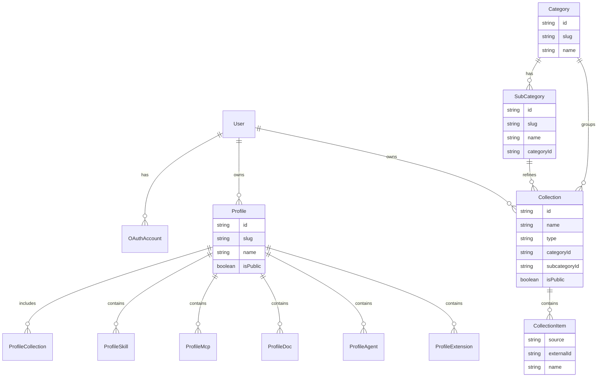
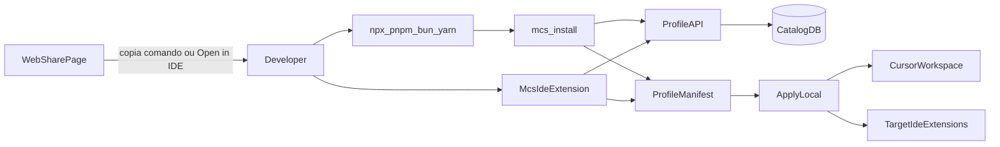

# PRD My Collec Skills

## Decisões fechadas
- **Entrega:** `docs/PRD.md` + features em [`.devtool/features/`](.devtool/features/) + **bootstrap de banco local**
- **Plataforma MVP:** híbrido — app web para montar/compartilhar perfis + fluxo para aplicar no ambiente local
- **IDE principal no MVP:** Cursor (skills, MCPs, agents); extensões modeladas por IDE (Cursor/VS Code) desde o início
- **Auth MVP:** login OAuth com **GitHub** e **GitLab** (sem email/senha próprio no MVP)
- **Stack técnica (aprovada):** documentada em [`docs/STACK.md`](../../docs/STACK.md) — monorepo pnpm, Next.js App Router, Auth.js, Route Handlers + Zod, CLI `mcs`, extensão IDE, `@mcs/apply-engine`, `@mcs/manifest`
- **Banco local (início técnico):** **Docker + PostgreSQL + Prisma**
  - Postgres via `docker-compose`
  - ORM/migrations via Prisma
  - `DATABASE_URL` em `.env` (`.env` no `.gitignore`; `.env.example` versionado)
- **UI (obrigatório):** interface **100% shadcn/ui**
  - Componentes apenas via registry/CLI shadcn (Button, Card, Form, Dialog, Sidebar, Table, Tabs, etc.)
  - Sem bibliotecas de UI concorrentes (Material, Chakra, Ant, MUI, etc.)
  - Sem componentes custom “do zero” que duplicem o que o shadcn já oferece — compor a partir dos primitives
  - Tokens semânticos do tema (`bg-background`, `text-muted-foreground`, `primary`, etc.); layout com Tailwind utilitário
  - Skill de referência na implementação: `shadcn`
- **Catálogo externo:** conectores diretos a skills, documentações e MCPs/LLMs
- **Coleções por categoria e subcategoria (P0) — Skills, Agents e MCPs:** o usuário seleciona itens e organiza em **coleções** com taxonomia em dois níveis, com o mesmo padrão para os três tipos
  - Tipos de coleção: `skill` | `agent` | `mcp`
  - **Category** (nível 1) + **SubCategory** (nível 2) — obrigatórios em toda Collection
  - Exemplos de categorias seed: `UI`, `UX`, `Accessibility`, `Database`, `Cybersecurity` (extensíveis; reutilizadas entre tipos)
  - Exemplos de subcategorias seed (ilustrativos):
    - `UI` → `Components`, `DesignSystem`, `Animation`
    - `UX` → `Flows`, `Research`, `Copy`
    - `Accessibility` → `WCAG`, `ARIA`, `Testing`
    - `Database` → `PostgreSQL`, `Prisma`, `Migrations`
    - `Cybersecurity` → `OWASP`, `Auth`, `Secrets`
  - Uma coleção tem: tipo + categoria + **subcategoria** + nome/descrição + N itens selecionados
  - Subcategorias são compartilhadas entre skills/agents/MCPs (mesma árvore); a Collection diferencia pelo `type`
  - Coleções são reutilizáveis e anexáveis a um ou mais **Profiles**
  - Fluxo: buscar no conector → selecionar → escolher categoria/subcategoria → criar/atualizar coleção → (opcional) anexar ao profile
- **CLI `mcs` (P0) — apply sem fricção:** comando de instalação do perfil no espírito de `npm` / `pnpm` / `bun` / `yarn install`
  - Nome: **`mcs`** (abreviação de **My Collec Skills**)
  - Distribuição: pacote CLI publicável; uso via `npx mcs`, `pnpm dlx mcs`, `bunx mcs`, `yarn dlx mcs`, ou binário global `mcs`
  - Comando principal de apply:
    ```bash
    mcs install --username <user> --perfil <slug>
    ```
  - Equivalentes sem fricção (mesma UX mental do install de pacotes):
    ```bash
    npx mcs install --username alice --perfil nextjs-prisma
    pnpm dlx mcs install --username alice --perfil nextjs-prisma
    bunx mcs install --username alice --perfil nextjs-prisma
    yarn dlx mcs install --username alice --perfil nextjs-prisma
    ```
  - Comportamento: resolve o profile público (ou autorizado) por `username` + `perfil` (slug), baixa o manifesto e aplica no workspace local (skills, agents, MCPs, docs refs, extensões da IDE) com feedback claro no terminal
  - Flags MVP: `--username` (obrigatório), `--perfil` (obrigatório); P1: `--dry-run`, `--force`, `--ide cursor|vscode`
  - A CLI é um dos caminhos de **apply local** (terminal / CI / onboarding); a web gera o comando pronto para copiar
- **Extensão de IDE `mcs` (P0) — gerenciamento e apply na IDE:** extensão própria do My Collec Skills para gerenciar skills/coleções/profiles e aplicar no ambiente local sem sair do editor
  - Alvo MVP: **Cursor** (API compatível com VS Code); P1: publicar também no marketplace VS Code
  - Capacidades MVP:
    - login / sessão (GitHub ou GitLab) dentro da extensão
    - listar e buscar profiles / coleções (categoria → subcategoria)
    - visualizar skills, agents e MCPs do profile
    - **Apply** do profile no workspace local (mesmo motor/manifesto da CLI)
    - status do que já está aplicado vs pendente
  - UX: painel/sidebar + comandos da Command Palette (ex.: `MCS: Install Profile`, `MCS: Manage Collections`)
  - A extensão e a CLI compartilham o **ApplyEngine** e o contrato do manifesto
- **Fora do MVP:** marketplace próprio avançado, monetização, sync multi-device, extensões para JetBrains/Nova/Windsurf nesta fase, SSO corporativo além de GitHub/GitLab, banco gerenciado em cloud nesta etapa

## O que será produzido

### 1. Documento [`docs/PRD.md`](docs/PRD.md)
Estrutura do PRD (conteúdo de produto) + seção de **stack técnica inicial**:

1. Visão, problema, proposta de valor, personas
2. Conceitos de domínio: Profile, **Category**, **SubCategory**, **Collection** (tipos skill/agent/mcp), Skill, MCP, DocSource, Agent, IDE Extension, Connector, User/OAuthAccount
3. Auth GitHub/GitLab
4. Conectores externos (skills/docs/MCPs)
5. **Coleções por categoria/subcategoria** — taxonomia em 2 níveis para skills, agents e MCPs; reutilizar em profiles
6. **CLI `mcs`** — `mcs install --username --perfil`; UX tipo package-manager install; integração com página de share
7. **Extensão de IDE `mcs`** — painel na IDE para gerenciar skills/coleções/profiles e apply local (Cursor-first)
8. User journeys MVP (web monta → share → apply via **CLI ou extensão**)
9. RF P0/P1 e RNF
10. Arquitetura lógica (web + conectores + **MCS CLI** + **MCS IDE Extension** + Postgres)
11. Manifesto JSON do perfil (contrato consumido pela CLI e pela extensão; collections com `category` + `subcategory`)
12. **Stack e persistência local** — ver [`docs/STACK.md`](../../docs/STACK.md): monorepo pnpm, Next.js, Auth.js, Route Handlers + Zod, Docker Compose (Postgres), Prisma, CLI `mcs`, extensão IDE, `@mcs/apply-engine` + `@mcs/manifest`
13. **UI / design system** — 100% shadcn/ui na web; extensão com UI nativa da IDE (TreeView, Webview se necessário)
14. Escopo / não-escopo, métricas, riscos, milestones

### 2. Features no kanban [`.devtool/features/`](.devtool/features/)
- `prd-documento-base`
- `db-local-docker-prisma` — Postgres no Docker + Prisma bootstrap
- `ui-shadcn` — app web com shadcn/ui como único design system
- `auth-github-gitlab`
- `connectors-skills-docs-mcps`
- `collections-by-category` — coleções por **categoria + subcategoria** para skills, agents e MCPs
- `domain-profile-manifest`
- `web-profile-crud`
- `catalog-skills-categories`
- `profile-mcps-agents`
- `profile-ide-extensions`
- `share-profile-link`
- `cli-mcs-install` — CLI `mcs install --username --perfil` (apply sem fricção)
- `ide-extension-mcs` — extensão Cursor/VS Code para gerenciar e aplicar profiles localmente
- `apply-profile-local` — motor de apply compartilhado pela CLI e pela extensão

### 3. Bootstrap técnico local (após o PRD definir o domínio)

Arquivos esperados:

- [`docker-compose.yml`](docker-compose.yml) — serviço `postgres` (porta `5432`, volume persistente, healthcheck)
- [`.env.example`](.env.example) — `DATABASE_URL=postgresql://...@localhost:5432/my_collec_skills`
- [`.gitignore`](.gitignore) — incluir `.env`, `node_modules`, artefatos gerados do Prisma
- [`prisma/schema.prisma`](prisma/schema.prisma) — models iniciais do domínio
- [`prisma.config.ts`](prisma.config.ts) — config Prisma (v7) com `DATABASE_URL`
- Primeira migration via `prisma migrate dev`

**Models iniciais (schema mínimo alinhado ao PRD):**



- `Collection.type`: enum `skill` | `agent` | `mcp`
- Toda Collection exige `categoryId` + `subcategoryId` (subcategoria deve pertencer à categoria)
- Categorias seed: `ui`, `ux`, `accessibility`, `database`, `cybersecurity`
- Subcategorias seed por categoria (ex.: `database/postgresql`, `database/prisma`, `ui/components`, …)
- Itens avulsos no Profile (`ProfileSkill` / `ProfileAgent` / `ProfileMcp`) continuam permitidos além das coleções
- Resolução da CLI: `User.username` (ou handle público) + `Profile.slug` → manifesto → apply

Convenções Prisma: IDs `cuid()`, `createdAt`/`updatedAt`, índices em `slug`, `username`, `categoryId`, `subcategoryId`, `type`, `@@unique([categoryId, slug])` em SubCategory, `provider+providerAccountId`, relações bidirecionais com `@relation`.

Skills de referência na execução: `prisma-cli-init`, `prisma-database-setup-postgresql`, `prisma-cli-migrate-dev`.

## Arquitetura apply (CLI + Extensão IDE)



## Fontes externas a documentar no PRD
- Skills: bibliotecas/repositórios públicos (Cursor/community)
- Docs: URLs/docs oficiais por stack
- MCPs: [MCP Registry](https://registry.modelcontextprotocol.io/), [Cursor Marketplace](https://cursor.com/marketplace), [cursor.directory](https://cursor.directory)

## Ordem de execução (após aprovação)
1. Escrever `docs/PRD.md` (inclui stack Docker/Postgres/Prisma + contrato da CLI `mcs` + extensão IDE)
2. Criar features no `.devtool/features/` (incl. `cli-mcs-install`, `ide-extension-mcs`)
3. Subir bootstrap: `docker-compose.yml` + `.env.example` + Prisma init/schema + migration inicial
4. Validar: container healthy + `prisma migrate status` ok
5. Ainda **não** implementar auth OAuth, scaffold shadcn, CLI `mcs`, extensão IDE nem conectores nesta etapa — só PRD + kanban + base de dados local (CLI e extensão ficam **especificadas** no PRD e nas features)

## Critério de pronto
- PRD completo com decisões fechadas (híbrido, Cursor-first, GitHub/GitLab, conectores, coleções categoria/subcategoria, **CLI `mcs`**, **extensão IDE `mcs`**, Postgres/Prisma/Docker, UI 100% shadcn)
- Kanban com features linkadas ao PRD (incl. `collections-by-category`, `cli-mcs-install`, `ide-extension-mcs`, `db-local-docker-prisma`, `ui-shadcn`)
- Postgres local rodando via Docker e schema Prisma migrado com models do domínio mínimo (`Category`, `SubCategory`, `Collection` tipada, `Profile`, `username` para resolução da CLI/extensão, …)
