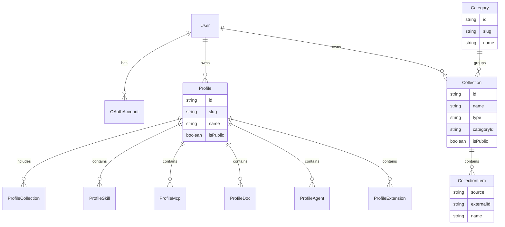

# PRD My Collec Skills

## Decisões fechadas
- **Entrega:** `docs/PRD.md` + features em [`.devtool/features/`](.devtool/features/) + **bootstrap de banco local**
- **Plataforma MVP:** híbrido — app web para montar/compartilhar perfis + fluxo para aplicar no ambiente local
- **IDE principal no MVP:** Cursor (skills, MCPs, agents); extensões modeladas por IDE (Cursor/VS Code) desde o início
- **Auth MVP:** login OAuth com **GitHub** e **GitLab** (sem email/senha próprio no MVP)
- **Banco local (início técnico):** **Docker + PostgreSQL + Prisma**
  - Postgres via `docker-compose`
  - ORM/migrations via Prisma
  - `DATABASE_URL` em `.env` (`.env` no `.gitignore`; `.env.example` versionado)
- **UI (obrigatório):** interface **100% shadcn/ui**
  - Componentes apenas via registry/CLI shadcn (Button, Card, Form, Dialog, Sidebar, Table, Tabs, etc.)
  - Sem bibliotecas de UI concorrentes (Material, Chakra, Ant, MUI, etc.)
  - Sem componentes custom “do zero” que duplicem o que o shadcn já oferece — compor a partir dos primitives
  - Tokens semânticos do tema (`bg-background`, `text-muted-foreground`, `primary`, etc.); layout com Tailwind utilitário
  - Skill de referência na implementação: `shadcn`
- **Catálogo externo:** conectores diretos a skills, documentações e MCPs/LLMs
- **Coleções por categoria (P0) — Skills, Agents e MCPs:** o usuário seleciona itens e organiza em **coleções** por categoria, com o mesmo padrão para os três tipos
  - Tipos de coleção: `skill` | `agent` | `mcp`
  - Exemplos de categorias seed: `UI`, `UX`, `Accessibility`, `Database`, `Cybersecurity` (extensíveis; reutilizadas entre tipos)
  - Uma coleção tem tipo + categoria + nome/descrição + N itens selecionados
  - Coleções são reutilizáveis e anexáveis a um ou mais **Profiles** (o profile monta o pacote a partir de coleções + itens avulsos)
  - Fluxo: buscar no conector → selecionar → adicionar à coleção da categoria → (opcional) anexar coleção ao profile
- **Fora do MVP:** marketplace próprio avançado, monetização, sync multi-device, plugins nativos oficiais da IDE, SSO corporativo além de GitHub/GitLab, banco gerenciado em cloud nesta etapa

## O que será produzido

### 1. Documento [`docs/PRD.md`](docs/PRD.md)
Estrutura do PRD (conteúdo de produto) + seção de **stack técnica inicial**:

1. Visão, problema, proposta de valor, personas
2. Conceitos de domínio: Profile, **Category**, **Collection** (tipos skill/agent/mcp), Skill, MCP, DocSource, Agent, IDE Extension, Connector, User/OAuthAccount
3. Auth GitHub/GitLab
4. Conectores externos (skills/docs/MCPs)
5. **Coleções por categoria** — selecionar skills **e também agents e MCPs**; criar/editar coleções (UI, UX, A11y, Banco, Cibersec, …); reutilizar em profiles
6. User journeys MVP (montar coleções por tipo+categoria e anexar ao profile)
7. RF P0/P1 e RNF
8. Arquitetura lógica (web + conectores + apply local + **Postgres**)
9. Manifesto JSON do perfil (incl. `collections[]` tipadas: skill/agent/mcp, agrupadas por categoria)
10. **Stack e persistência local** — Docker Compose (Postgres), Prisma schema/migrations, variáveis de ambiente
11. **UI / design system** — 100% shadcn/ui; telas de catálogo, editor de coleção (por tipo), editor de profile
12. Escopo / não-escopo, métricas, riscos, milestones

### 2. Features no kanban [`.devtool/features/`](.devtool/features/)
- `prd-documento-base`
- `db-local-docker-prisma` — Postgres no Docker + Prisma bootstrap
- `ui-shadcn` — app web com shadcn/ui como único design system
- `auth-github-gitlab`
- `connectors-skills-docs-mcps`
- `collections-by-category` — coleções por categoria para **skills, agents e MCPs**
- `domain-profile-manifest`
- `web-profile-crud`
- `catalog-skills-categories`
- `profile-mcps-agents`
- `profile-ide-extensions`
- `share-profile-link`
- `apply-profile-local`

### 3. Bootstrap técnico local (após o PRD definir o domínio)

Arquivos esperados:

- [`docker-compose.yml`](docker-compose.yml) — serviço `postgres` (porta `5432`, volume persistente, healthcheck)
- [`.env.example`](.env.example) — `DATABASE_URL=postgresql://...@localhost:5432/my_collec_skills`
- [`.gitignore`](.gitignore) — incluir `.env`, `node_modules`, artefatos gerados do Prisma
- [`prisma/schema.prisma`](prisma/schema.prisma) — models iniciais do domínio
- [`prisma.config.ts`](prisma.config.ts) — config Prisma (v7) com `DATABASE_URL`
- Primeira migration via `prisma migrate dev`

**Models iniciais (schema mínimo alinhado ao PRD):**

- `Collection.type`: enum `skill` | `agent` | `mcp`
- Categorias seed no MVP: `ui`, `ux`, `accessibility`, `database`, `cybersecurity` (compartilhadas entre tipos)
- Itens avulsos no Profile (`ProfileSkill` / `ProfileAgent` / `ProfileMcp`) continuam permitidos além das coleções

Convenções Prisma: IDs `cuid()`, `createdAt`/`updatedAt`, índices em `slug`, `categoryId`, `type`, `provider+providerAccountId`, relações bidirecionais com `@relation`.

Skills de referência na execução: `prisma-cli-init`, `prisma-database-setup-postgresql`, `prisma-cli-migrate-dev`.

## Fontes externas a documentar no PRD
- Skills: bibliotecas/repositórios públicos (Cursor/community)
- Docs: URLs/docs oficiais por stack
- MCPs: [MCP Registry](https://registry.modelcontextprotocol.io/), [Cursor Marketplace](https://cursor.com/marketplace), [cursor.directory](https://cursor.directory)

## Ordem de execução (após aprovação)
1. Escrever `docs/PRD.md` (inclui stack Docker/Postgres/Prisma)
2. Criar features no `.devtool/features/`
3. Subir bootstrap: `docker-compose.yml` + `.env.example` + Prisma init/schema + migration inicial
4. Validar: container healthy + `prisma migrate status` ok
5. Ainda **não** implementar auth OAuth, scaffold shadcn da app nem conectores nesta etapa — só PRD + kanban + base de dados local (UI 100% shadcn fica **especificada** no PRD e na feature `ui-shadcn`)

## Critério de pronto
- PRD completo com decisões fechadas (híbrido, Cursor-first, GitHub/GitLab, conectores, **coleções por categoria para skills/agents/MCPs**, Postgres/Prisma/Docker, UI 100% shadcn)
- Kanban com features linkadas ao PRD (incl. `collections-by-category`, `db-local-docker-prisma`, `ui-shadcn`)
- Postgres local rodando via Docker e schema Prisma migrado com models do domínio mínimo (`Category`, `Collection` tipada, `Profile`, …)
